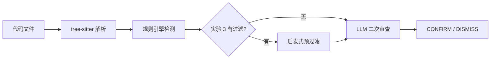

# 假阳性过滤实验报告

> 探索规则引擎与 LLM 在代码审查中的最优分工边界。

---

## 1. 背景

`qtcloud-code-cli` 是一个基于 tree-sitter 的多语言代码静态分析 CLI。其核心工作是扫描代码、检出 potential issues（finding）并呈现给用户。

存在问题：**假阳性噪音**。用户运行 review 看到 23 个 finding，其中 8 个是"测试函数太长"、4 个是"`__init__.py` 没有对应测试"。几轮之后，用户对工具失去信任——每个 finding 都需要人工二次判断，工具的"筛选"价值被抵消。

---

## 2. 实验设计

三次对照实验，验证"启发式预过滤 + LLM 二次审查"的两级流水线是否能有效降低假阳性率。

### 实验设置

| | 实验 1 | 实验 2 | 实验 3 |
|--|--------|--------|--------|
| 项目 | qtcloud-code（小，7 files） | qtcloud-devops（大，23 files） | qtcloud-devops |
| 启发式过滤 | 无 | 无 | 有 |
| 目的 | 基线 | 基线 | 验证启发式规则效果 |

### 实验流程



---

## 3. 实验结果

### 3.1 实验 1：qtcloud-code（基线，小项目）

| 指标 | 值 |
|------|---|
| 总 finding 数 | 7 |
| LLM 确认 (CONFIRM) | 6 |
| LLM 驳回 (DISMISS) | 1 |
| 驳回率 | 14.3% |

驳回 1 项：`refactor/mod.rs:1` 模块声明，理由"无业务逻辑"。

---

### 3.2 实验 2：qtcloud-devops（基线，大项目）

| 指标 | 值 |
|------|---|
| 总 finding 数 | 23 |
| LLM 确认 | 15 |
| LLM 驳回 | 8 |
| 驳回率 | **34.8%** |

#### 驳回分类

| 分类 | 数量 | 占比 | 典型理由 |
|------|------|------|---------|
| 测试函数 | 3 | 37.5% | "测试函数，合理范围" |
| 骨架文件 | 4 | 50.0% | "无实际代码逻辑" |
| LLM 不确定 | 1 | 12.5% | "逻辑复杂，不一定违反 SRP" |

---

### 3.3 实验 3：qtcloud-devops（有启发式过滤）

在 `long-function` 检测器中跳过测试函数，在 `missing-tests` 检测器中跳过骨架文件。

#### 对比

| 指标 | 无过滤 | 有过滤 | 变化 |
|------|--------|--------|------|
| 总 findings | 23 | 12 | -47.8% |
| LLM DISMISS | 8 | 0 | -100% |
| 驳回率 | 34.8% | **0.0%** | -34.8 pp |
| LLM 调用次数 | 23 | 12 | -47.8% |

#### 启发式过滤明细

已过滤的 11 项 finding 包括：

- **测试函数过长 ×7**：`long-function` 检测器在 `#[test]` 或 `test_` 前缀的函数上产生
- **骨架文件缺测试 ×4**：`missing-tests` 检测器在 `__init__.py`、`build.rs`、`mod.rs`、`lib.rs` 上产生

> **注意**：7 个被过滤的测试函数中，有 3 个在实验 2 中被 LLM 确认为真问题（CONFIRM）。这是有意的权衡：测试代码的结构和长度要求与生产代码不同，`long-function` 在此类代码上噪音过多，跳过利大于弊。

---

## 4. 分析

### 4.1 假阳性分布

```
驳回分类（实验 2，n=8）
├── 模式化假阳性（7 个，87.5%） ← 可用启发式规则覆盖
│   ├── 测试函数      3 个 (37.5%)
│   └── 骨架文件      4 个 (50.0%)
└── LLM 边界情况（1 个，12.5%）← 需要语义理解
    └── scan_single_submodule: 57 行，逻辑复杂但职责单一
```

### 4.2 关键发现

| 发现 | 来源 | 影响 |
|------|------|------|
| 87.5% 的 LLM 驳回可由启发式规则替代 | 实验 2 驳回分类 | 3 行 `if` 可替代 7 次 LLM 调用 |
| 启发式过滤后驳回率降至 0% | 实验 3 | 剩余 LLM 调用的判断全部为真问题 |
| LLM 调用量降低 47.8% | 实验 2 → 3 | 成本、延迟、不确定性的同步下降 |
| 边界情况 LLM 能正确处理 | `scan_single_submodule` 案例 | LLM 在语义判断上不可替代 |

---

## 5. 结论

### 5.1 两级流水线架构已验证

```
扫描 → 检测 → 启发式过滤 → LLM 二次审查 → 最终报告
               │               │
          跳过模式化假阳性    处理边界情况
          (87.5% 的驳回)     (12.5% 的驳回)
```

### 5.2 已实现的启发式规则

| 规则 | 文件 | 逻辑 |
|------|------|------|
| 跳过测试函数 | `detector/long_function.rs` | `has_#[test]_attribute \|\| name.starts_with("test_")` |
| 跳过骨架文件 | `detector/missing_tests.rs` | 文件名匹配 + 声明检查 |

### 5.3 产品设计原则

1. **规则引擎做 80%：** 确定性判断，离线可用，零成本
2. **启发式规则做 15%：** 模式化假阳性预过滤，低成本
3. **LLM 做最后 5%：** 边界情况语义判断，仅在需要时调用

这条分界线保障了产品在离线、低成本、可复现和智能之间的可交付平衡。

---

## 6. 下一步

转向"证据链组织"方向的探索：不是"要不要 LLM"，而是"给 LLM 看什么证据，它才能做最准的判断"。具体方向包括：

- 提取函数调用图、数据流片段作为 LLM 上下文
- 比较不同证据组织方式对 LLM 判断准确率的影响
- 定义"证据质量"度量指标
